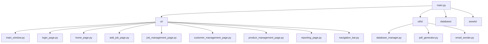
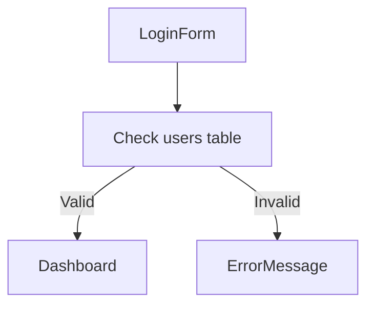
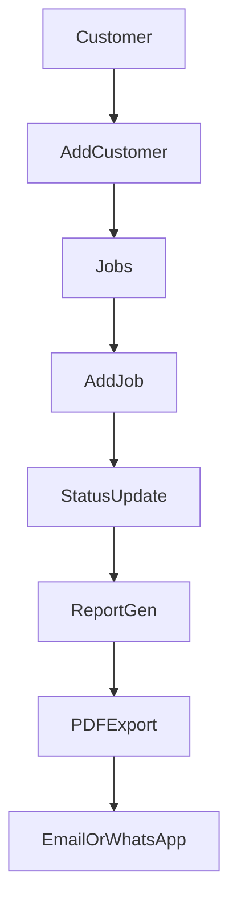
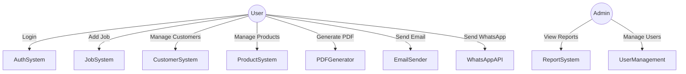
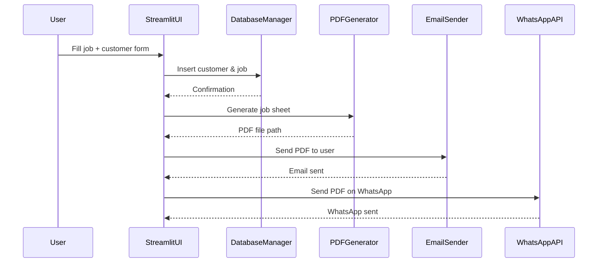
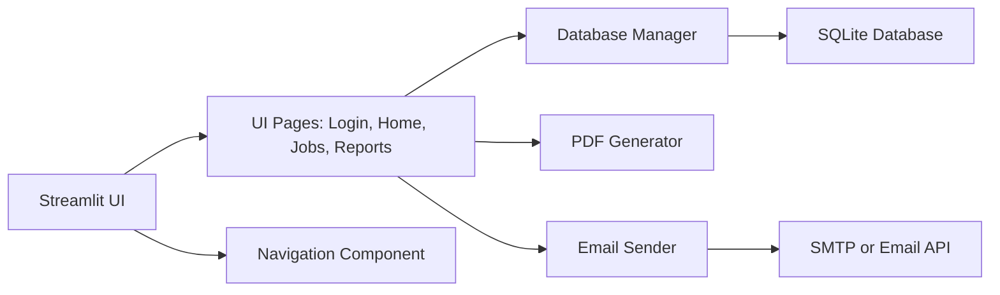
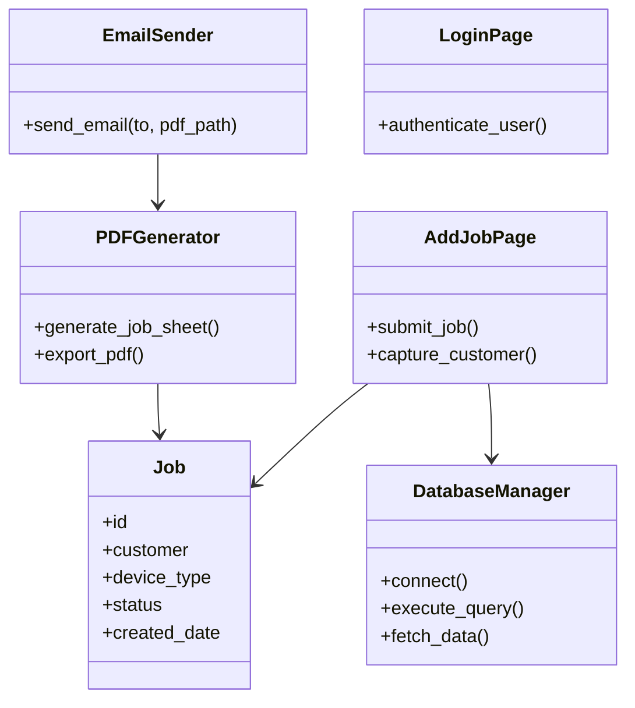
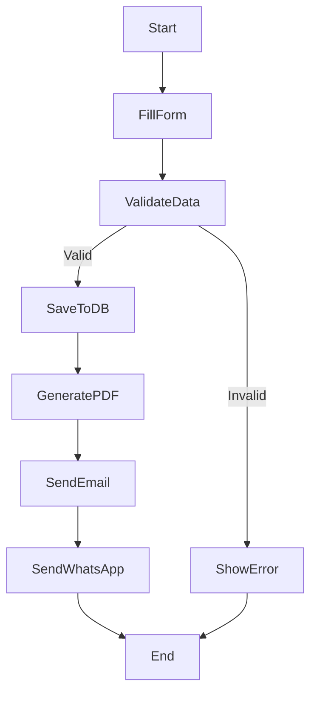
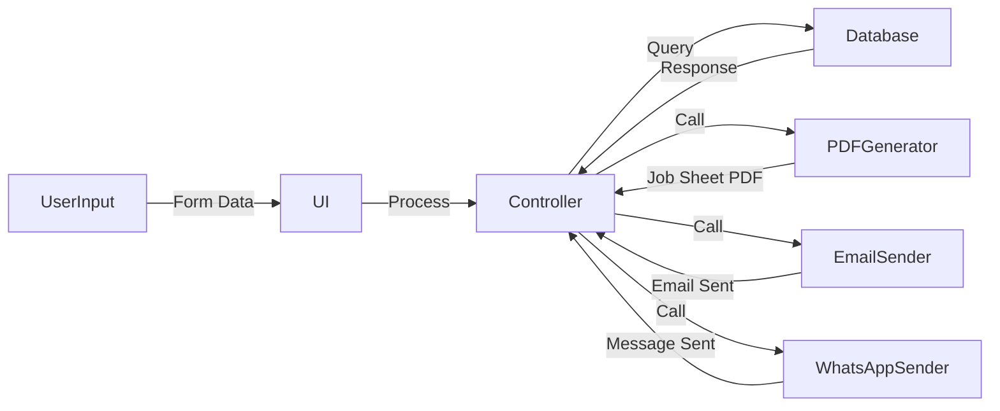

# 📋 refactored-JobSheet

A **Streamlit-based Job Sheet Management System** designed for mobile/computer repair shops. The system streamlines job tracking, customer and product management, PDF generation, and automated communication via email and WhatsApp.

---

## 🚀 Project Description

`refactored-JobSheet` is a lightweight, modular, and database-driven application that helps small to mid-size repair businesses handle everyday operations efficiently. Built using **Python, Streamlit, and SQLite**, the app provides an intuitive interface for technicians and administrators to manage repair jobs, customer records, and inventory — all in one place.

Whether it's printing a job receipt, managing device repairs, or tracking customer history, this app does it all with minimal setup and no server dependencies.

---

## 🔑 Key Features

| Feature                  | Description                                                                 |
|--------------------------|-----------------------------------------------------------------------------|
| 📦 SQLite Integration    | Local, structured data storage for persistent state                         |
| 🧾 PDF Job Sheets        | Automatically generate professional-looking job reports                     |
| 📤 Email/WhatsApp Share | Send job sheets directly to customers via email or WhatsApp (Twilio-ready) |
| 🔐 User Authentication   | Role-based login (Admin, Staff)                                             |
| 🛠️ Job Management       | Add, edit, track and close repair jobs with real-time updates               |
| 👥 Customer Management   | Manage customer profiles (add/edit/delete/search)                           |
| 📦 Product Inventory     | Track spare parts and accessories                                           |
| 🔍 Smart Search          | Instantly search through jobs and customers                                 |
| 📈 Reporting & Analytics | Generate job completion reports, revenue stats, etc.                        |

---

<!-- ## 📁 Project Structure

```plaintext
refactored-JobSheet/
│
├── main.py                         # Entry point for the Streamlit app
├── requirements.txt                # Python dependencies
│
├── database/
│   └── repair_shop.db              # SQLite database file
│
├── ui/
│   ├── main_window.py              # Routing and layout logic
│   ├── login_page.py               # Login and authentication logic
│   ├── home_page.py                # Dashboard with navigation
│   ├── add_job_page.py             # Add new jobs & generate job sheets
│   ├── job_management_page.py      # Manage/edit/export jobs
│   ├── customer_management_page.py # CRUD for customers
│   ├── product_management_page.py  # Manage products & pricing
│   ├── reporting_page.py           # Analytics and reporting
│   └── navigation_bar.py           # Sidebar/topbar navigation
│
├── utils/
│   ├── database_manager.py         # DB operations (CRUD)
│   ├── pdf_generator.py            # Job sheet PDF builder
│   └── email_sender.py             # Email sender utility
│
└── assets/
    └── logo.png                    # App branding/logo
```` -->
<!-- 
--- -->

## 🧠 Mermaid Diagrams

### 📂 Folder Structure



---

### 🔐 Authentication Flow



---

### 🔄 Job Lifecycle Flow


---

### 📈 Reporting Flow



---

## 📊 Software Design Diagrams

---

### 1. ✅ **Use Case Diagram** – Job Sheet System



---

### 2. 🔄 **Sequence Diagram** – Job Creation & Notification Flow




### 3 🧩 Component Diagram – Application Architecture (Fixed ✅)



---


### 4. 🏗️ **Class Diagram** – Major Python Modules



---

### 5. 🔁 **Activity Diagram** – Job Submission



---

### 6. 🧪 **Data Flow Diagram (Level 1)**



---

## 🧾 Summary

These diagrams provide full architectural and functional insight into how your `# refactored-JobSheet` app operates:

| Diagram Type      | Purpose                                                       |
| ----------------- | ------------------------------------------------------------- |
| Use Case Diagram  | Shows system functionality from the user's perspective        |
| Sequence Diagram  | Explains interaction between components during job submission |
| Component Diagram | Shows how modules interact within the system                  |
| Class Diagram     | Illustrates Python module and class structures                |
| Activity Diagram  | Captures the logic behind submitting a repair job             |
| Data Flow Diagram | Visualizes the movement of data across system layers          |

---

## 🛠️ Installation

### 1. Clone the repo

```bash
git clone https://github.com/jayanth119/refactored-JobSheet.git
cd refactored-JobSheet
```

### 2. Setup environment

```bash
python -m venv venv
source venv/bin/activate  # Windows: venv\Scripts\activate
```

### 3. Install dependencies

```bash
pip install -r requirements.txt
```

### 4. Run the application

```bash
streamlit run main.py
```

---

## 📌 Example Users (for demo)

| Username | Password | Role  |
| -------- | -------- | ----- |
| admin    | admin123 | Admin |
| staff1   | pass123  | Staff |

---

## 📧 Contact

Built with ❤️ by [Jayanth ](mailto:chjayanth119@gmail.com)
GitHub: [github.com/jayanth119](https://github.com/jayanth119)
```